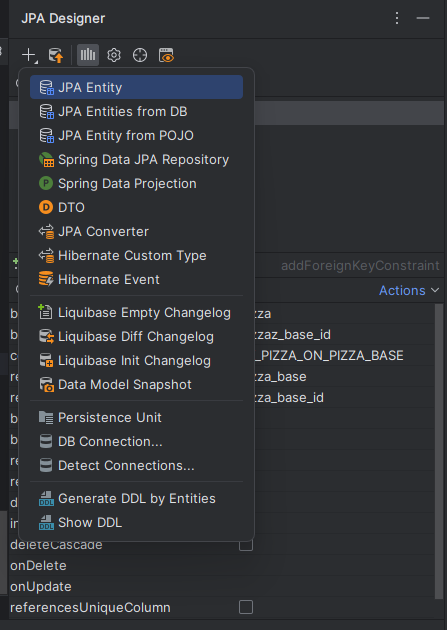

## установка плагина и генерация db.changelog.xml
* ставим из магазина дополнений этот плагин
https://plugins.jetbrains.com/plugin/15075-jpa-buddy
* перезапускаем идею
* открываем проект, и открываем пустой (если начальная генерация) файл db.changelog.xml
* справа у нас может появится окно с JPA Designer 
* в нем по плюсику выпадает доп меню, и в данном текущем случае нас интересует пункт Liquibase Init Changelog (начальное заполнение БД), также доступны
  * Liquibase Empty Changelog (пустой файл с шапкой)
  * Liquibase Diff Changelog (создать сhangeset с изменениями)
* видео с примерами работы этого функционала по адресу https://youtu.be/26qri-FIwWo
и файл сгенерированный генератором прилагаю.[db.changelog.xml](src/main/resources/db/changelog/db.changelog.xml)